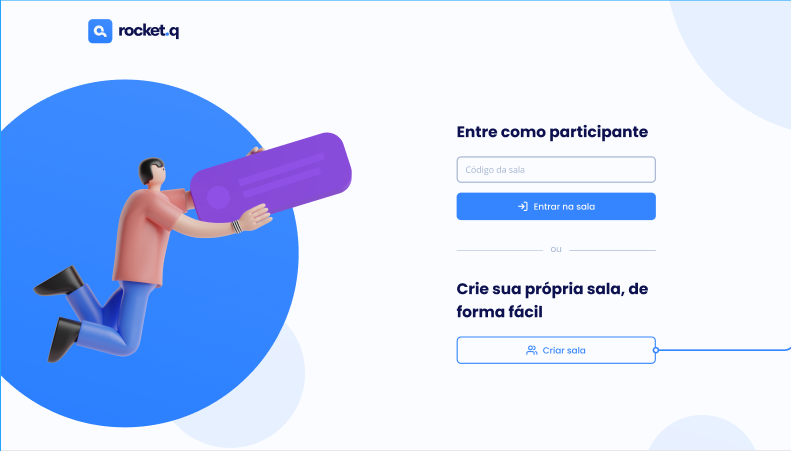

<h1 align="center">
  
</h1>

  <a href="#-tecnologias">Tecnologias</a>&nbsp;&nbsp;&nbsp;|&nbsp;&nbsp;&nbsp;
  <a href="#-projeto">Projeto</a>&nbsp;&nbsp;&nbsp;|&nbsp;&nbsp;&nbsp;
  <a href="#-layout">Layout</a>&nbsp;&nbsp;&nbsp;|&nbsp;&nbsp;&nbsp;
  <a href="#memo-licença">Licença</a>

 

  

 

  

## 🚀 Tecnologias

Este proyecto fue desarrollado con las siguientes tecnologías:

- HTML
- CSS
- JavaScript
- NodeJS
- EJS
- Express
- SQLite

## 💻 Proyecto

O Rocket.Q es una aplicación de interacción a través de preguntas, siendo posible crear una sala para que los internautas anónimos hagan preguntas y el creador de la sala, en posesión de una contraseña, gestione estas preguntas y las marque como leídas.

## 🔖 Layout

Puede ver el diseño del proyecto a través de [desse link](https://www.figma.com/file/vp3iFfd1ohCbHyDX9jCiQi/Roquet.q). Es necesario tener una cuenta en el [Figma](https://figma.com) para acceder a él.

## :memo: Licencia

Este proyecto está bajo la licencia del MIT. Ver el archivo [LICENSE](.github/LICENSE.md) para más detalles.

---

Hecho con ♥ by Rocketseat :wave: [Únete a nuestra comunidad!](https://discordapp.com/invite/gCRAFhc)
